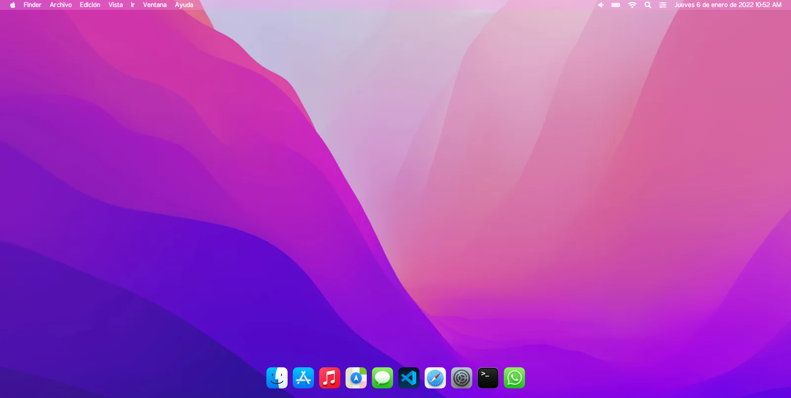

# macOS

Réplica del sistema operativo macOS Monterey utilizando HTML, CSS y JavaScript.

    

        
    

## GitHub pages

* https://jonathan-yv.github.io/macOS/

## Componentes

### Ventanas creadas
* Finder
* Maps
* Safari
* Terminal

### Características
* Reloj
* Cerrar
* Maximizar
* Minimizar
* Cambio de tamaño de las ventanas
* Movimiento de ventanas
* Pantalla de carga
* Pantalla de inicio de sesión

## Autor ✒️

* **Jonathan Yair Vazquez Uriostegui**